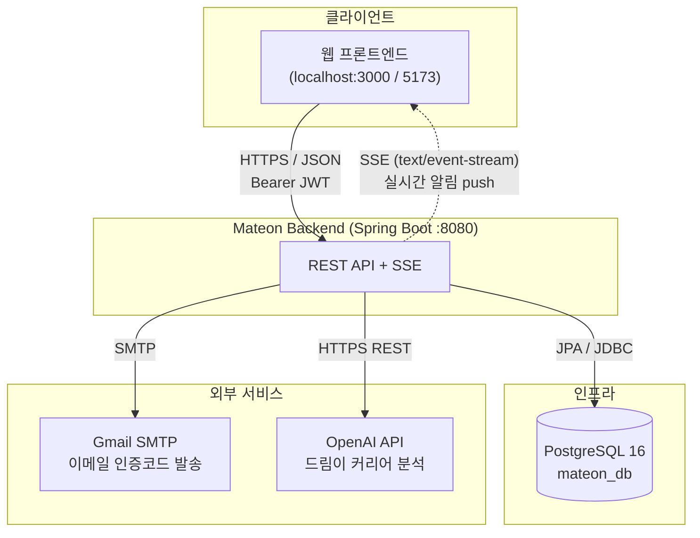
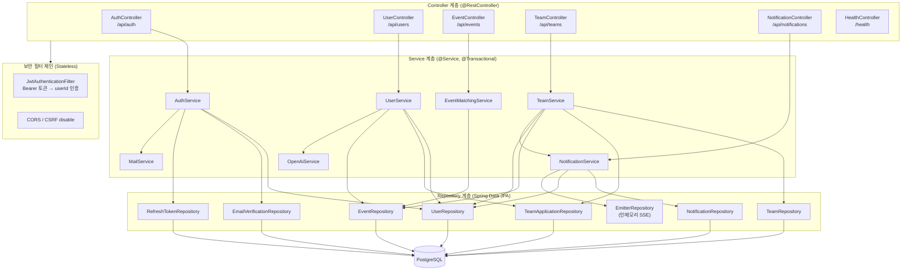
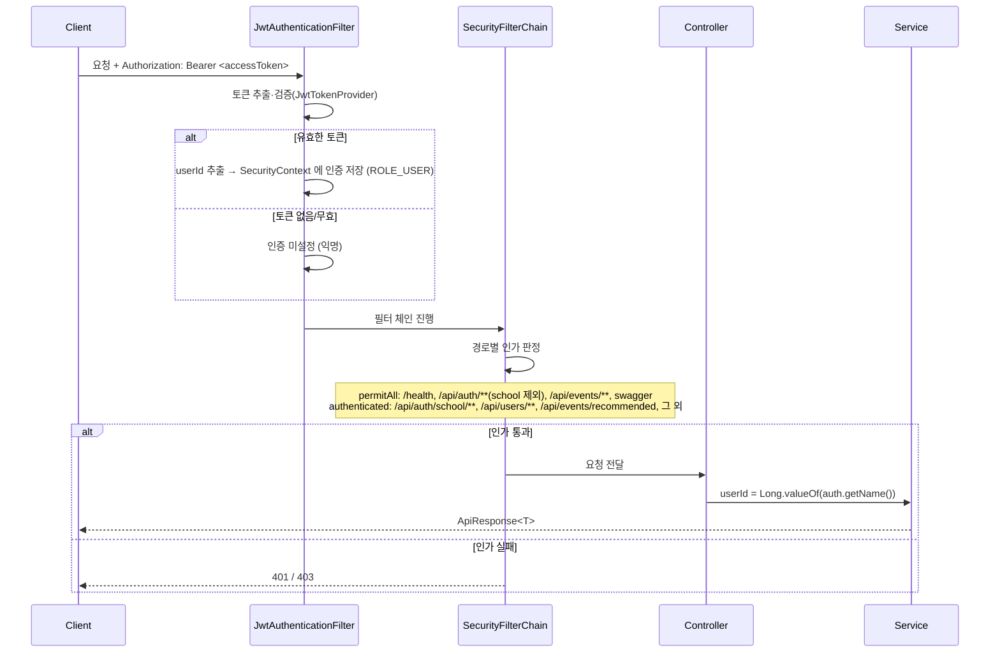
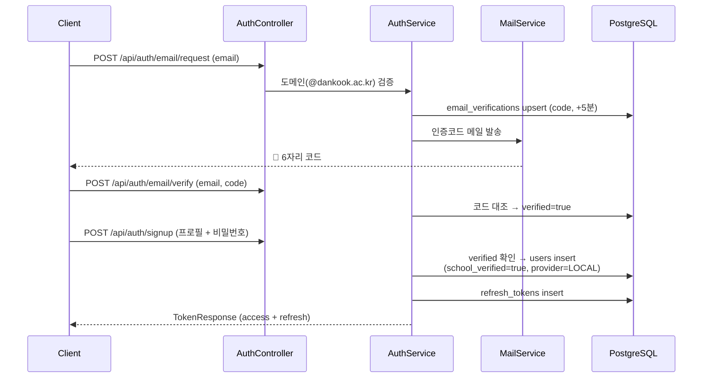
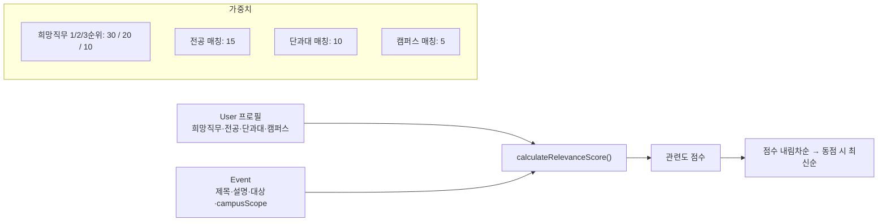
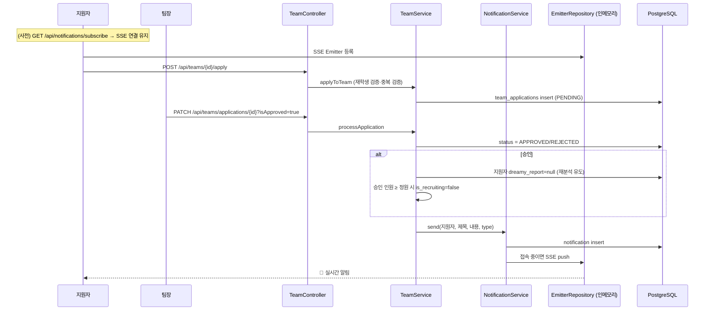
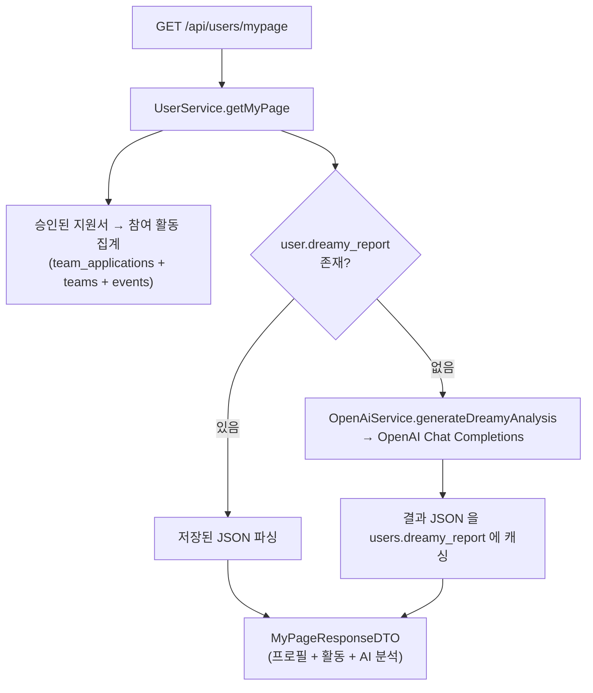
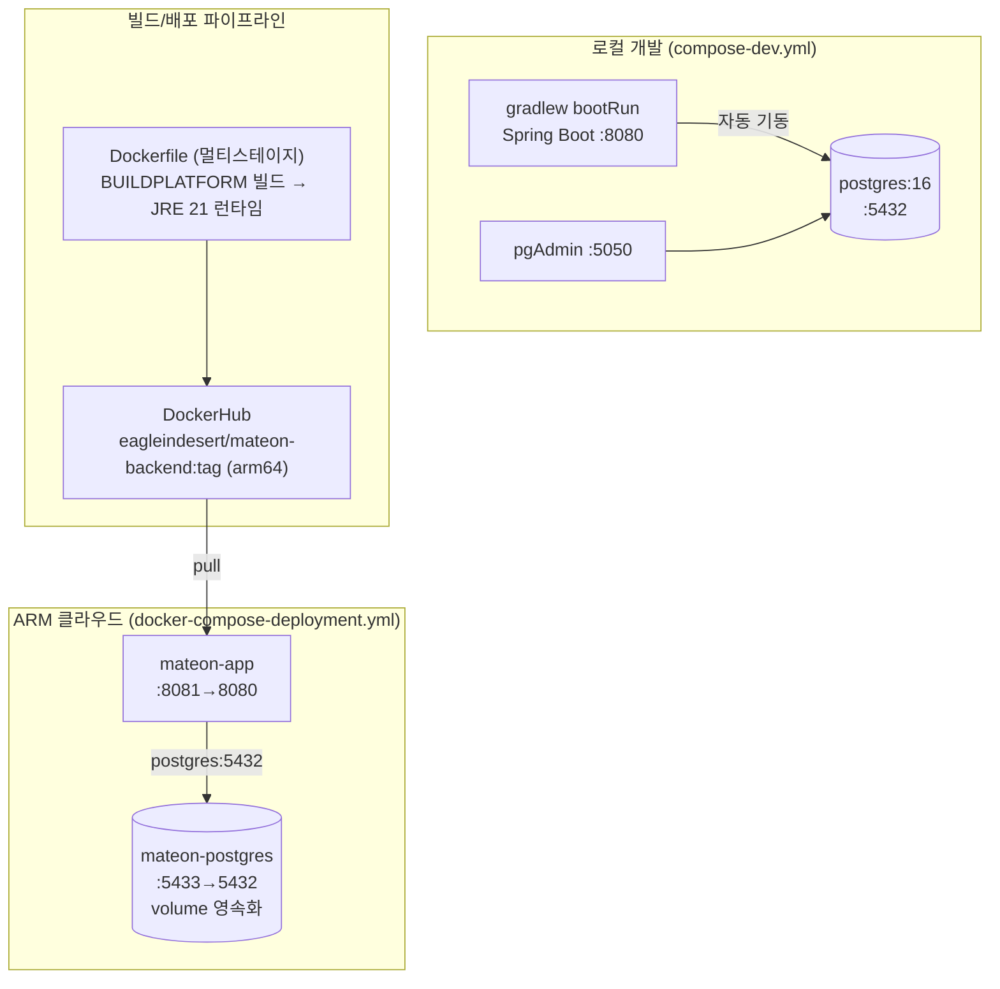

# Mateon Backend — 아키텍처

**Mateon** 은 대학생 대상 팀 매칭 / 활동 모집 서비스의 백엔드입니다.
사용자 인증(로컬 + 소셜 대비 + 학교 재학생 인증), 활동(이벤트) 추천, 팀 모집·지원, 실시간 알림(SSE), AI 커리어 분석을 REST API 로 제공합니다.

- **런타임**: Java 21 / Spring Boot 4.0
- **핵심 스택**: Spring Web MVC · Spring Security(JWT, Stateless) · Spring Data JPA · PostgreSQL 16
- **외부 연동**: Gmail SMTP(이메일 인증) · OpenAI Chat Completions(커리어 분석) · SSE(실시간 알림)
- **문서**: springdoc OpenAPI(Swagger UI) / API 명세는 [api-spec.md](api-spec.md), DB 스키마는 [schema-db.md](schema-db.md)

---

## 1. 시스템 컨텍스트



---

## 2. 레이어드 아키텍처

전형적인 Controller → Service → Repository → Entity 3계층 구조이며, 도메인별 패키지로 수직 분할되어 있습니다.



### 패키지 구조 (도메인 수직 분할)

```
com.example.mateon
├── auth          인증: 로그인/회원가입/JWT/이메일·학교 인증
│   ├── controller · service · jwt(JwtTokenProvider, JwtAuthenticationFilter)
│   ├── domain(EmailVerification, RefreshToken) · dto · repository
├── user          사용자 프로필/마이페이지/AI 분석
│   ├── controller · service(UserService, OpenAiService)
│   ├── domain(User, AuthProvider) · dto · repository
├── events        활동(이벤트) 조회·추천 매칭
│   ├── controller · service(EventMatchingService)
│   ├── models(Event) · dto · repository
├── teams         팀 모집·지원 관리
│   ├── controller · service · converter(RoleListConverter)
│   ├── domain(Team, TeamApplication, ApplicationStatus) · dto · repository
├── notification  SSE 실시간 알림
│   ├── controller · service · domain(Notification)
│   ├── dto · repository(NotificationRepository, EmitterRepository)
├── mail          Gmail SMTP 발송 (MailService)
├── common        공통 응답(ApiResponse)·예외(MateonException, ErrorCode)·헬스체크
└── config        SecurityConfig · JwtProperties · RestTemplateConfig
```

---

## 3. 인증 · 인가 흐름

Stateless JWT 기반. 모든 요청은 `JwtAuthenticationFilter` 를 거치며, 유효한 Bearer 토큰이 있으면
`Authentication.getName()` 에 **userId** 가 담깁니다. (이메일이 아닌 userId 기준으로 인증 — 소셜 로그인 대비)



### 회원가입 흐름 (소셜 우선 · 학교 인증 후행 재설계)

로컬 가입은 **이메일 인증 → 회원가입** 순서로 진행되며, 로컬 가입 유저는 가입 시점에 학교(재학생) 인증까지 확정됩니다.
소셜 유저는 로그인 후 별도로 `/api/auth/school/**` 에서 학교 이메일 인증을 거쳐 재학생(`school_verified=true`)이 됩니다.



---

## 4. 핵심 도메인 흐름

### 활동(이벤트) 추천 매칭

`EventMatchingService` 가 사용자 프로필과 이벤트를 가중치 기반으로 스코어링해 정렬/추천합니다. (DB 조회 후 인메모리 스코어링)



- `GET /api/events/search` — 필터(단과대/카테고리) 적용 후, 로그인 상태면 관련도순 정렬.
- `GET /api/events/recommended` — 카테고리별 최고 점수 활동 1개씩 추천(**인증 필요**).

### 팀 지원 → 승인/거절 → 실시간 알림

팀 모집·지원 액션은 **학교 인증(재학생)** 이 완료된 유저만 가능(`requireSchoolVerified`).
팀장이 지원서를 처리하면 `NotificationService` 가 DB 영속화와 SSE 실시간 push 를 동시에 수행합니다.



### 마이페이지 & AI 커리어 분석 ('드림이')



> 프로필 수정 또는 새 활동 승인 시 `dreamy_report` 를 `null` 로 비워 다음 조회 때 재분석되도록 유도합니다.

---

## 5. 공통 규약

- **응답 포맷**: 모든 API 는 `ApiResponse<T>` 로 감싸 반환 (`success`, `message`, `data`).
- **예외 처리**: `MateonException` + `ErrorCode` 를 `GlobalExceptionHandler` 에서 일괄 변환.
- **감사 필드**: `@CreatedDate` / `@LastModifiedDate` (JPA Auditing) 또는 `@PrePersist`/`@PreUpdate` 로 타임스탬프 관리.
- **스키마 관리**: `ddl-auto=update` — 엔티티 변경이 곧 스키마 변경. 상세는 [schema-db.md](schema-db.md).

---

## 6. 배포 토폴로지

로컬 개발은 `bootRun` 이 `compose-dev.yml`(PostgreSQL + pgAdmin)을 자동 기동합니다.
배포는 멀티스테이지 Docker 이미지(빌드 amd64 네이티브 → 실행 arm64)를 DockerHub 로 push 후, ARM 클라우드에서 compose 로 실행합니다.



| 환경 | Compose 파일 | 앱 포트 | DB 포트 | 비고 |
| --- | --- | --- | --- | --- |
| 로컬 개발 | `compose-dev.yml` | 8080 (bootRun) | 5432 | pgAdmin 5050 포함 |
| 배포(ARM) | `docker-compose-deployment.yml` | 8081→8080 | 5433→5432 | DockerHub 이미지 pull, 시크릿은 `.env` 주입 |

- **시크릿 주입**: `MAIL_*`, `JWT_*`, `OPENAI_*` 는 `.env`(로컬) 또는 compose `env_file`/`environment`(배포)로 주입.
- **DataSource**: 배포 시 `SPRING_DATASOURCE_URL=jdbc:postgresql://postgres:5432/mateon_db` 로 compose 네트워크 내 서비스명 접속.
