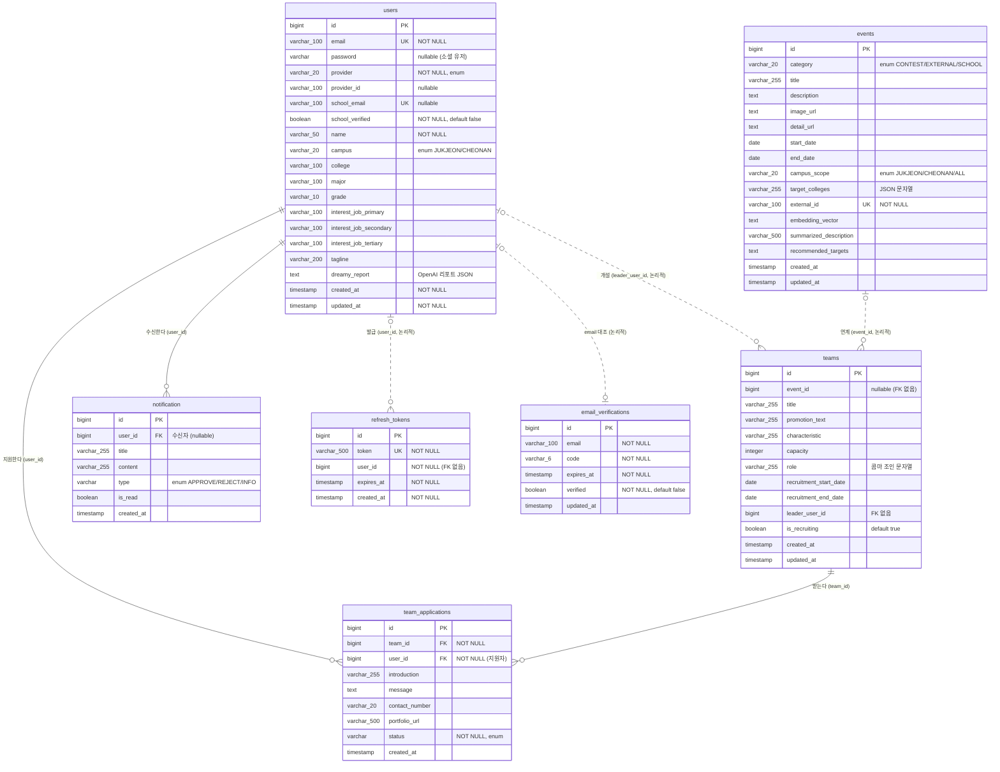

# Mateon Backend — 데이터베이스 스키마

> 이 문서는 `src/main/java` 의 JPA 엔티티에서 역으로 도출한 PostgreSQL 스키마입니다.
> DDL 은 `spring.jpa.hibernate.ddl-auto=update` 로 애플리케이션 기동 시 Hibernate 가 자동 생성/갱신하며,
> 물리 컬럼명은 Spring Boot 기본 네이밍 전략(camelCase → snake_case)을 따릅니다.

- **DBMS**: PostgreSQL 16 (`postgres:16-alpine`)
- **DB 이름**: `mateon_db`
- **접속**: 로컬 `localhost:5432` (dev) / 배포 compose 네트워크 내 `postgres:5432`
- **스키마 관리**: JPA `ddl-auto=update` (수동 마이그레이션 스크립트는 없음)

---

## ERD

> **실선(`||--o{`)** = JPA `@ManyToOne`/`@JoinColumn` 으로 실제 외래키 제약이 생성되는 관계.
> **점선(`|o..o{`)** = 컬럼(`user_id`, `event_id`, `leader_user_id`)만 존재하고 DB 외래키 제약이 없는 **논리적 참조**. 애플리케이션 코드에서 ID 로 조회·정합성 관리.

---

## 테이블 상세

### 1. `users` — 사용자 계정 / 프로필
소셜 로그인과 로컬 가입을 함께 지원하는 통합 계정 테이블.

| 컬럼 | 타입 | 제약 | 설명 |
| --- | --- | --- | --- |
| `id` | `bigint` | PK, IDENTITY | |
| `email` | `varchar(100)` | UNIQUE, NOT NULL | 로그인 이메일 |
| `password` | `varchar(255)` | nullable | BCrypt 해시. 소셜 유저는 `null` |
| `provider` | `varchar(20)` | NOT NULL | `LOCAL`, `KAKAO`, `GOOGLE`, `NAVER`, `APPLE` |
| `provider_id` | `varchar(100)` | nullable | 소셜 provider 내 고유 ID. 로컬은 `null` |
| `school_email` | `varchar(100)` | UNIQUE, nullable | 학교(재학생) 인증 이메일 `@dankook.ac.kr` |
| `school_verified` | `boolean` | NOT NULL, default `false` | 재학생 인증 여부 |
| `name` | `varchar(50)` | NOT NULL | 이름 |
| `campus` | `varchar(20)` | enum | `JUKJEON`(죽전), `CHEONAN`(천안) |
| `college` | `varchar(100)` | | 단과대학 |
| `major` | `varchar(100)` | | 전공 |
| `grade` | `varchar(10)` | | 학년 |
| `interest_job_primary` | `varchar(100)` | | 희망직무 1순위 |
| `interest_job_secondary` | `varchar(100)` | | 희망직무 2순위 |
| `interest_job_tertiary` | `varchar(100)` | | 희망직무 3순위 |
| `tagline` | `varchar(200)` | | 한 줄 소개 |
| `dreamy_report` | `text` | | OpenAI '드림이' 분석 리포트 JSON. 프로필 수정/새 활동 승인 시 `null` 로 초기화되어 재생성 유도 |
| `created_at` | `timestamp` | NOT NULL, 불변 | 감사 필드 (`@CreatedDate`) |
| `updated_at` | `timestamp` | NOT NULL | 감사 필드 (`@LastModifiedDate`) |

- **복합 유니크 제약**: `uk_users_provider_provider_id (provider, provider_id)` — 동일 소셜 계정 중복 가입 방지.

### 2. `email_verifications` — 이메일 인증 코드
회원가입 이메일 인증과 로그인 후 학교 이메일 인증에 공용으로 사용. 이메일당 1행을 유지(갱신)한다.

| 컬럼 | 타입 | 제약 | 설명 |
| --- | --- | --- | --- |
| `id` | `bigint` | PK, IDENTITY | |
| `email` | `varchar(100)` | NOT NULL | 인증 대상 이메일 |
| `code` | `varchar(6)` | NOT NULL | 6자리 인증 코드 |
| `expires_at` | `timestamp` | NOT NULL | 만료 시각(발급 +5분) |
| `verified` | `boolean` | NOT NULL, default `false` | 인증 완료 여부 |
| `updated_at` | `timestamp` | | `@LastModifiedDate` |

### 3. `refresh_tokens` — JWT 리프레시 토큰
| 컬럼 | 타입 | 제약 | 설명 |
| --- | --- | --- | --- |
| `id` | `bigint` | PK, IDENTITY | |
| `token` | `varchar(500)` | UNIQUE, NOT NULL | 리프레시 토큰 문자열 |
| `user_id` | `bigint` | NOT NULL | 소유 유저 ID (DB FK 없음) |
| `expires_at` | `timestamp` | NOT NULL | 만료 시각 |
| `created_at` | `timestamp` | NOT NULL, 불변 | |

- 로그인/비밀번호 변경/로그아웃 시 해당 유저의 기존 토큰을 삭제(`deleteByUserId`)하여 세션 1개를 유지.

### 4. `events` — 활동(공모전/대외활동/교내) 정보
외부 크롤링/수집 데이터로 채워지는 활동 카탈로그. 사용자 프로필과 매칭해 추천에 활용.

| 컬럼 | 타입 | 제약 | 설명 |
| --- | --- | --- | --- |
| `id` | `bigint` | PK, IDENTITY | |
| `category` | `varchar(20)` | enum | `CONTEST`(공모전), `EXTERNAL`(대외활동), `SCHOOL`(교내) |
| `title` | `varchar(255)` | | 제목 |
| `description` | `text` | | 상세 설명 |
| `image_url` | `text` | | 이미지 URL |
| `detail_url` | `text` | | 원문 링크 |
| `start_date` | `date` | | 시작일 |
| `end_date` | `date` | | 종료일 |
| `campus_scope` | `varchar(20)` | enum | `JUKJEON`, `CHEONAN`, `ALL` |
| `target_colleges` | `varchar(255)` | | 대상 단과대학 (JSON/문자열, `LIKE` 검색 대상) |
| `external_id` | `varchar(100)` | UNIQUE, NOT NULL | 외부 소스 고유 식별자(중복 수집 방지) |
| `embedding_vector` | `text` | | 임베딩 벡터(문자열 직렬화) |
| `summarized_description` | `varchar(500)` | | 요약 설명 |
| `recommended_targets` | `text` | | 추천 대상 |
| `created_at` | `timestamp` | 불변 | `@PrePersist` 로 세팅 |
| `updated_at` | `timestamp` | | `@PreUpdate` 로 세팅 |

### 5. `teams` — 팀 모집글
| 컬럼 | 타입 | 제약 | 설명 |
| --- | --- | --- | --- |
| `id` | `bigint` | PK, IDENTITY | |
| `event_id` | `bigint` | nullable | 연계 활동 ID. `null` 이면 '자율' 모집 (FK 없음) |
| `title` | `varchar(255)` | | 모집글 제목 |
| `promotion_text` | `varchar(255)` | | 진행 방식·한 줄 소개 |
| `characteristic` | `varchar(255)` | | 팀 특성 |
| `capacity` | `integer` | | 모집 정원 |
| `role` | `varchar(255)` | | 모집 역할 목록. `List<String>` 을 콤마 조인(`RoleListConverter`) |
| `recruitment_start_date` | `date` | | 모집 시작일 |
| `recruitment_end_date` | `date` | | 모집 종료일 |
| `leader_user_id` | `bigint` | | 팀장(작성자) 유저 ID (FK 없음) |
| `is_recruiting` | `boolean` | default `true` | 모집 중 여부. 정원 충족 시 `false` |
| `created_at` | `timestamp` | 불변 | |
| `updated_at` | `timestamp` | | |

### 6. `team_applications` — 팀 지원서
| 컬럼 | 타입 | 제약 | 설명 |
| --- | --- | --- | --- |
| `id` | `bigint` | PK, IDENTITY | |
| `team_id` | `bigint` | NOT NULL, **FK → teams.id** | 지원 대상 팀 |
| `user_id` | `bigint` | NOT NULL, **FK → users.id** | 지원자 |
| `introduction` | `varchar(255)` | | 간단 소개글 |
| `message` | `text` | | 지원 동기 |
| `contact_number` | `varchar(20)` | | 연락처 |
| `portfolio_url` | `varchar(500)` | | 포트폴리오/GitHub 링크 |
| `status` | `varchar` | NOT NULL, enum | `PENDING`, `APPROVED`, `REJECTED` |
| `created_at` | `timestamp` | 불변 | `@CreatedDate` |

- 동일 유저가 같은 팀에 중복 지원할 수 없도록 애플리케이션 레벨에서 `(team_id, user_id)` 존재 여부를 검증.

### 7. `notification` — 알림
> `@Table` 미지정으로 테이블명은 클래스명 기반 `notification` (단수형).

| 컬럼 | 타입 | 제약 | 설명 |
| --- | --- | --- | --- |
| `id` | `bigint` | PK, IDENTITY | |
| `user_id` | `bigint` | **FK → users.id**, nullable | 수신자 |
| `title` | `varchar(255)` | | 알림 제목 (예: "가입승인") |
| `content` | `varchar(255)` | | 알림 내용 |
| `type` | `varchar` | enum | `APPROVE`, `REJECT`, `INFO` |
| `is_read` | `boolean` | | 읽음 여부 |
| `created_at` | `timestamp` | | `@CreatedDate` |

---

## 참고: DB 에 저장되지 않는 상태

- **SSE Emitter** (`EmitterRepository`): 실시간 알림 연결은 인메모리 `ConcurrentHashMap` 로 관리되며 DB 테이블이 아니다. 알림 **내용**만 `notification` 테이블에 영속화되고, 접속 중인 사용자에게는 SSE 로 즉시 push 된다.

## 참고: 주요 조회 패턴

- **활동 검색** (`events`): `category` 필터 + `target_colleges LIKE '%college%'` 네이티브 쿼리, 전체 조회 시 `ORDER BY RANDOM()`.
- **팀 목록** (`teams`): `event_id`, `leader_user_id`, `is_recruiting`, 연계 이벤트 `category` 기준 조회.
- **지원 현황** (`team_applications`): `countByTeamIdAndStatus(APPROVED)` 로 현재 인원 집계, `findByApplicantIdAndStatus(APPROVED)` 로 마이페이지 참여 활동 집계.
- **알림** (`notification`): `findAllByReceiverIdOrderByCreatedAtDesc`.
